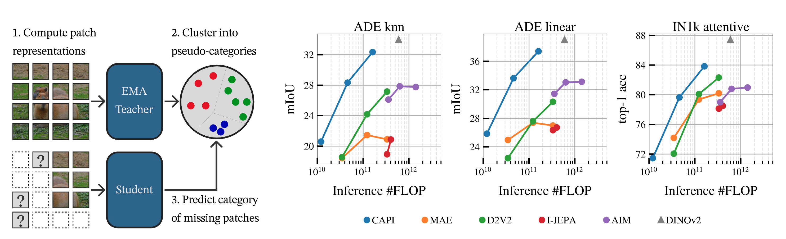
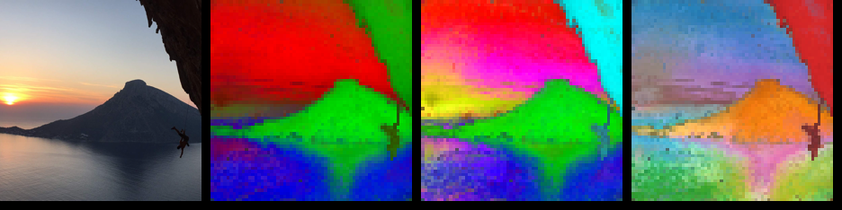
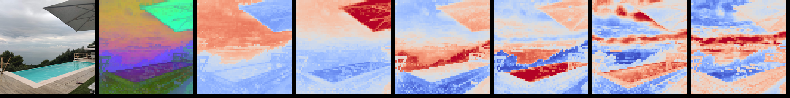

# CAPI: Cluster and Predict Latents Patches for Improved Masked Image Modeling
[[`ArXiv`](https://arxiv.org/abs/2502.08769)] [[`BibTeX`](#citing-capi)]

**[Meta AI Research, FAIR](https://ai.facebook.com/research/)**

[Timothée Darcet](https://x.com/TimDarcet),
[Federico Baldassare](https://x.com/BaldassarreFe),
Maxime Oquab,
Julien Mairal,
Piotr Bojanowski

PyTorch implementation and pretrained models for CAPI. For details, see [**Cluster and Predict Latents Patches for Improved Masked Image Modeling**](https://arxiv.org/abs/2502.08769). This repository contains the code and models to reproduce the paper.



## Pretrained models
| arch     | #params | FLOP/fwd @224 | Pretraining dataset | k-nn ADE20K | attentive IN1k | weights |
|----------|---------|---------------|---------------------|-------------|----------------|---------|
| ViT-L/14 | 302M    |      1.70E+11 | Places205           |        35.2 |           79.2 | [weights](https://dl.fbaipublicfiles.com/capi/capi_vitl14_p205.pth)   |
| ViT-L/14 | 302M    |      1.70E+11 | LVD-142M            |        32.1 |           83.8 | [weights](https://dl.fbaipublicfiles.com/capi/capi_vitl14_lvd.pth)   |
| ViT-L/14 | 302M    |      1.70E+11 | IN22k               |        29.7 |           83.6 | [weights](https://dl.fbaipublicfiles.com/capi/capi_vitl14_i22k.pth)   |
| ViT-L/14 | 302M    |      1.70E+11 | IN1k                |        29.2 |           82.9 | [weights](https://dl.fbaipublicfiles.com/capi/capi_vitl14_in1k.pth)   |

### Pretrained models on PyTorch Hub
```python
import torch

capi_vitl14_p205 = torch.hub.load('facebookresearch/capi:main', 'capi_vitl14_p205')
capi_vitl14_lvd = torch.hub.load('facebookresearch/capi:main', 'capi_vitl14_lvd')
capi_vitl14_in22k = torch.hub.load('facebookresearch/capi:main', 'capi_vitl14_in22k')
capi_vitl14_in1k = torch.hub.load('facebookresearch/capi:main', 'capi_vitl14_in1k')

# Simply call the models to encode an image
img = torch.zeros(1, 3, 224, 224)  # example img, replace with your stuff
global_repr, registers, feature_map = capi_vitl14_p205(img)

```

## Documentation

### Environment

The environment to run the code should be straightforward to create using [`uv`](https://github.com/astral-sh/uv). If you don't have it, you can install it using
```bash
curl -LsSf https://astral.sh/uv/install.sh | sh
```
Once it is installed, you can create your environment using 
```bash
uv venv
uv sync
```

This environment can be activated using `. .venv/bin/activate`, and deactivated using `deactivate`. For convenience, you can also run python scripts using the environment without activating it using `uv run script.py`.

If you prefer not using `uv`, you can create an env and install packages any other way (conda, virtualenv etc). The code will of course work with any environment matching the requirements in `pyproject.toml`.

### Pretraining
The training script is `train_capi.py`. It can be directly be invoked with a config path and optional command-line arguments:
```bash
python train_capi.py <config>.yaml [cfg_key1.cfg_key2=value] [cfg_key3=other_value] ...
```
To launch a distributed training on a Slurm cluster, you can use `train_distributed.py` with the same syntax, eg:
```bash
python train_distributed.py default_pretrain_config.yaml train.output_dir=/path/to/whatev
```
If you have a non-slurm cluster, you're on your own.

The default config reproduces CAPI ViT-L/14.

### Evaluation
To evaluate CAPI in one line, run:
```bash
python benchmark.py model_loader_kwargs.config_path=default_pretrain_config.yaml pretrained_weights=/path/to/weights.pth
```

The evaluations scripts are the python files starting with `eval_`, and they are runnable as is:
```bash
python eval_segmentation.py model_path=... model_loader_kwargs=... train_dataset_name=... test_dataset_name=...
```
The arguments given to evaluation scripts are `model_path`, `model_loader_kwargs` and eval-specific arguments passed to the specific `eval_model` function.

The evaluations include a visualisation script, if you run them you will get this sort of pretty pictures:


The script can only provide you with the colored visualizations, not the leftmost image. The trips are on your own budget.

### Baselines
All baselines considered in the paper are loadable using the files in `baselines/`. Eg:
```bash
python eval_segmentation.py model_path=baselines/data2vec2_loader.py model_loader_kwargs.model_name=data2vec2_vitb16
```

### Launching multiple evaluations
To facilitate launching multiple evaluations, `benchmark.py` provides a singl entry point. It takes a configuration argument to know which evals to launch, the default is `default_eval_config.py`.

## Datasets
The codebase supports a few data sources, and will download what it can automatically, but you may need to do some manual work.

The automatic downloads will be put in your cache folder: usually in `~/.cache/torch` and `~/.cache/huggingface`. If you prefer them to be saved somewhere else, the best option is to symlink thos folder to other locations.

The available data sources are `torchvision`, `hf` and `custom`. The syntax to specify a dataset is a URL syntax, with optional keyword arguments to be passed to the dataset: `data_source://dataset?key1=value1&key2=value2`. See below for examples.

### ImageNet-1k

You need to log in to download the data [here](https://imagenet.stanford.edu/), then use it with the torchvision ImageFolder loader:
```
data.dataset=torchvision://ImageFolder?root='/path/to/imagenet/train'
```

### ImageNet-22k
Can be streamed from huggingface with
```
data.dataset=hf://timm/imagenet-22k-wds?streaming=True&split='train'&img_field='jpg'
```
See "Huggingface datasets" for authentication details.

### ADE20K
Ready-to-use, will download the data if needed and cache it 
```
data.dataset=custom://ADE20K?split='training'
```

### Huggingface datasets
Some datasets need a HuggingFace token to be accessed.

To get that, go to https://huggingface.co/settings/tokens, "create new token", select read access, create the token then copy-paste it into `~/.cache/huggingface/token`.

Some datasets require you to accept terms of use before downloading: eg, for imagenet go to https://huggingface.co/datasets/ILSVRC/imagenet-1k and accept the things.

### Experimental
There is experimental support for VOC, IN22k, iNaturalist21, SUN397 and Places365. However, no guarantee is given on those.

## Codebase structure
Flat.
Main files to read:

- `train_capi.py`: Your main entrypoint, it contains the whole training loop with the bulk of the CAPI logic.
- `model.py`: A pretty standard vit implementation, as well as the code of the clustering head and model loading.
- `data.py`: Dataset, augmentations...
- `train_distributed.py`: Slurm distributed training logic.

Check the other files only when you need a specific info. Here is a map:
- `eval_visualizations.py`: Generate PCA visualisations of feature maps.
- `eval_segmentation.py`: [k-NN and logistic regression segmentation evals](https://creativereview.imgix.net/content/uploads/2012/02/ronseal_frame_b_01.jpg).
- `eval_classification.py`: [Linear and attentive classification evals](https://creativereview.imgix.net/content/uploads/2012/02/ronseal_frame_b_01.jpg).
- `benchmark.py`: A launcher to send multiple evals of the same model to a Slurm cluster.
- `utils.py`: 754 LOC. Miscellaneous functions, often their name should be self-explanatory and you should not have to look at their code. When it's not, well. Time to dive in.
- `fsdp.py`: 547 LOC. Implementation of [SimpleFSDP](https://arxiv.org/abs/2411.00284). Don't think about it.
- `hubconf.py`: The entrypoint for `torch.hub.load`.
- `pyproject.toml`: Dependencies, linting config, etc.
- `README.md`: You are here.


## Efficiency
The codebase should be pretty efficient. A few features:
- almost entirely cpu/gpu asynchronous, with a single sync point every 20 iter to print the loss
- fully torch.compile-able
- efficient overlapped FSDP (implementation in fsdp.py)
- overlapped cpu-to-gpu data transfer
- selective activation rematerialization (ie checkpointing), with customizable strategy

The codebase is optimized for relatively big models, ie ViT-L and above. It reaches its best efficiency at the 3B model size with about 58% MFU on 16 nodes of 8 A100. It's possible to train bigger with activation checkpointing, but it's not yet battle-tested.

If you need to optimize for your specific workloads:
- profile, profile, and profile again a bit more (use `train.profiling=true`)
- tweak the torch.compile args (eg with small models you may want to use cudagraphs\*)
- tweak the selective activation checkpointing strategy: you can trade memory for interconnect by checkpointing the `all_gather` ops, and you can trade for compute by checkpointing the matmuls or the flashattention.
- Optimize SM utilisation. You can try optimizing the shapes, or removing some ops that might be inefficient etc... We did not go there yet.

\* cudagraphs are not working right now, monitor this issue for more info: https://github.com/pytorch/pytorch/issues/130123


## Acknowledgements
Code built using the DINOv2 codebase. We thank Francisco Massa for the FSDP implementation. We also thank the countless and nameless contributors who built thousands of small snippets and tricks that ended up in this codebase.

## License

CAPI code and model weights are released under the Apache License 2.0. See [LICENSE](LICENSE) for additional details.

## Contributing

See [contributing](CONTRIBUTING.md) and the [code of conduct](CODE_OF_CONDUCT.md).

## Citing CAPI

If you find this repository useful, please consider giving a star :star: and citation [:t-rex:](wrong_animal):

```
@article{darcet2025capi,
  title   = {Cluster and Predict Latents Patches for Improved Masked Image Modeling},
  author  = {Darcet, Timoth{\'e}e and Baldassarre, Federico and Oquab, Maxime and Mairal, Julien and Bojanowski, Piotr},
  journal = {arXiv},
  year    = {2025}
}
```
